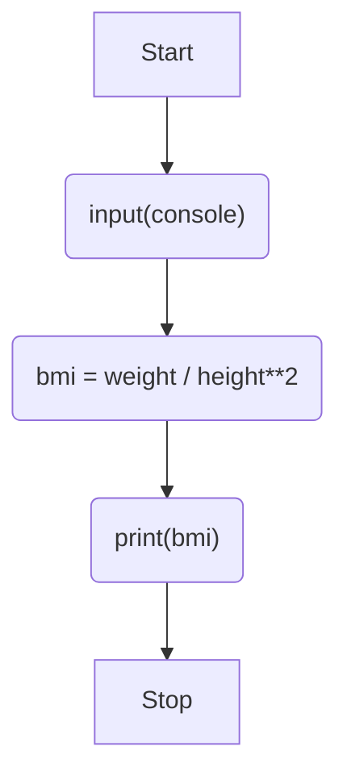

# Catatan: Tipe Data, Operasi Matematika, Manipulasi Angka & F-String

---
### Tipe Data
Tipe data pada python terbagi menjadi 4 yaitu.<br>

| Tipe Data | Deskripsi                                                                                                                                                | Contoh            |
|-----------|----------------------------------------------------------------------------------------------------------------------------------------------------------|-------------------|
| string    | Tipe data string merupakan tipe data yang menampung kumpulan karakter _unicode_                                                                          | `"Halo Dunia"`    |
| float     | float merupakan tipe data yang dapat menampung nilai desimal, contoh                                                                                     | `10`              |
| int       | Tipe data int merupakan tipe data yang menampung bilangan bulat seperti: 1,2,3..dst                                                                      | `123.45`          |
| boolean   | Tipe data boolean hanya memiliki 2 nilai yaitu True dan False. ipe data ini biasanya banyak digunakan untuk melakukan logika pada program yang kita buat | `True` or `False` |

Pada tipe data **string** kita bisa melakukan substring yang berguna untuk mengambil beberapa karakter dari string yang buat.
```python
name = "Bayu"
print(name[0])
```
Hasil Program
```pycon
'B'
```
Ketika kita membuat tipe data int dengan dengan jumlah angka terlalu banyak kita bisa menambahkan tanda **'_'** sebagai pemisah
```python
a = 1000000
b = 1_000_000 # terlihat mudah terbaca bukan
```


## Exercise & Project

---

### Exercise 2 - BMI Calculator
#### Flowchart

#### Code
```python
# 🚨 Don't change the code below 👇
height = input("enter your height in m: ")
weight = input("enter your weight in kg: ")
# 🚨 Don't change the code above 👆

#Write your code below this line 👇
bmi = float(weight) / float(height) ** 2
print(int(bmi))
```
